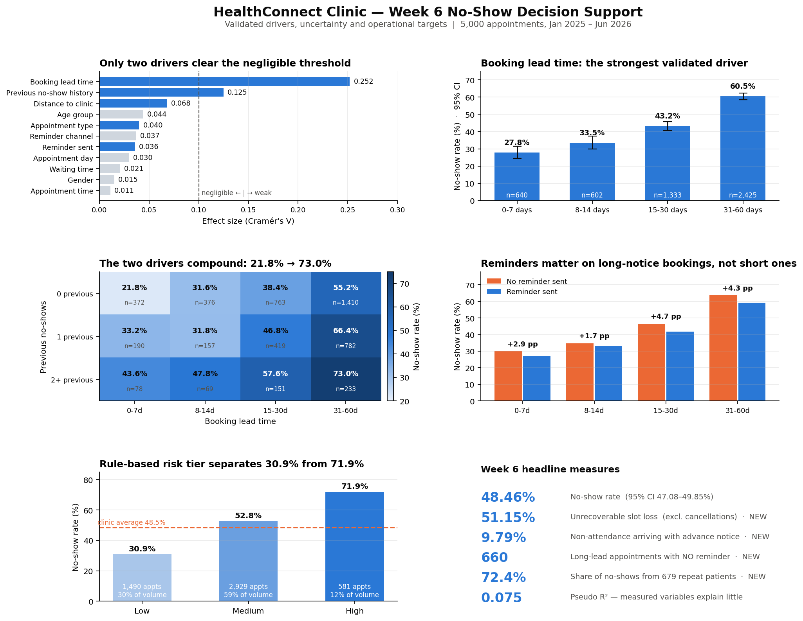

# HealthConnect Clinic — Week 6: Advanced Analytics, Validation & Decision Support

**AnalystLab Africa Data Analytics Internship Programme — HealthConnect Experience Lab**
Data Analytics Track · Week 6

## Overview

Week 5 produced a cleaned dataset, four KPIs, nine exploratory charts, and six business insights — but every finding was reported as a raw percentage difference, with no significance testing, no confidence intervals, and no group-size weighting.

Week 6 moved from exploration to validation:

- Tested every Week 5 finding for statistical significance and effect size
- Moved from one-variable-at-a-time analysis to adjusted, multivariate analysis
- Validated the four Week 5 KPIs and extended them into a decision-relevant set
- Converted validated findings into a usable handoff for the Data Science track
- Rebuilt the visualisation as a single decision-support view, not an exploratory gallery

## Key Findings

*5,000 appointments · January 2025 – June 2026*

| Finding | Detail |
|---|---|
| **Booking lead time** is the dominant driver | No-show rate rises from **27.81%** (0–7 days) to **60.49%** (31–60 days) · adjusted odds ratio 1.035/day |
| **Previous no-show history** is the second driver | Adjusted odds ratio **1.485** per prior no-show |
| The two **compound** | From 21.8% (no history, short notice) to **73.0%** (2+ prior no-shows, 31–60 days) — a 51 pp spread |
| **Reminders work, but coverage is flat** | Adjusted OR 0.830 (p = 0.006) — the one driver the clinic controls, yet coverage sits at ~72.7% regardless of risk |
| A **rule-based risk tier** beats guesswork | Separates a 71.94% no-show High tier (11.6% of volume) from a 30.87% Low tier — no model required |
| **Outreach caseload is concentrated** | 679 patients (40.0% of the patient base) account for **72.4%** of all no-shows |
| `waiting_time_minutes` **can't mean what Week 5 assumed** | Recorded for 2,386 no-shows with a mean indistinguishable from attended appointments |
| Explanatory power is limited | Pseudo R² = 0.075 — the measured variables can rank risk, not predict individuals confidently |



## Methodology

- **Significance testing:** Chi-square tests with Cramér's V effect sizes across 11 relationships
- **Uncertainty:** Wilson 95% confidence intervals for every reported group rate
- **Multivariate analysis:** Logistic regression to estimate each variable's association while holding others constant
- **Data integrity:** 5 new checks, 2 of which surfaced significant findings (including the `waiting_time_minutes` issue)
- **Segmentation:** Interaction analysis across booking lead time, prior no-show history, and reminder status
- **Risk scoring:** A 4-rule risk tier built from validated drivers and applied to all 5,000 appointments

## Data Science Track Integration

A five-part evidence pack was produced and transferred to the Data Science track to guide model-building:

| File | Contents |
|---|---|
| `HealthConnect_Week6_Feature_Specification.csv` | Every variable with test statistic, effect size, adjusted odds ratio, and an include/optional/exclude recommendation |
| `HealthConnect_Week6_Validated_Findings.csv` | The verdict on each Week 5 claim |
| `HealthConnect_Week6_Risk_Tier_Cohort.csv` | All 5,000 appointments labelled with a rule-based risk tier — the benchmark any model must beat |
| `HealthConnect_Week6_Refined_KPIs.csv` | The validated and extended KPI register |
| `HealthConnect_Week6_Integration_Record.docx` | Coordination record and exchange log |

**What changed as a result:** candidate features reduced from 18 columns to 7 evidence-supported features; validation design moved from a random 80/20 split to a patient-grouped split (GroupKFold on `patient_id`); `waiting_time_minutes` excluded pending a definition; success criterion changed from accuracy to ranking quality benchmarked against the 71.94% rule-based High tier.

## Repository Contents

```
├── HealthConnect_Week6_Advanced_Analytics.ipynb   # Full analysis notebook
├── HealthConnect_Week6_Project_Summary.docx       # Written project summary
├── HealthConnect_Week6_Integration_Record.docx    # Cross-track integration log
├── HealthConnect_Week6_Feature_Specification.csv
├── HealthConnect_Week6_Validated_Findings.csv
├── HealthConnect_Week6_Risk_Tier_Cohort.csv
├── HealthConnect_Week6_Refined_KPIs.csv
├── HealthConnect_Week6_Issue_Log.csv
├── HealthConnect_Week6_Dashboard.png
└── README.md
```

## Proposed Focus for Week 7

- Re-test validated drivers on a chronological holdout (Jan–Jun 2026)
- Test risk-tier stability across time and a patient-grouped split
- Sensitivity analysis on the reminder effect under non-random assignment
- Design a randomised reminder-channel test (~2,450 appointments per arm, 80% power)
- Regression-check the full KPI set across all 18 monthly cohorts
- Compare the Data Science candidate model's top-decile precision against the 71.94% rule-based benchmark
- Resolve the `waiting_time_minutes` definition with Project Management and the Knowledge Base

---
*AnalystLab Africa Data Analytics Internship Programme · Data Analytics Track*
